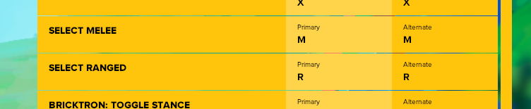
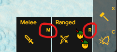

# Ranged / Melee keybindings
To add keybindings to Ranged / Melee as shown here





do the following

## Info\modconf\keybindings.lua
add
```
    { "General", "command_Ranged", "Select Ranged", {"R"} },
    { "General", "command_Melee", "Select Melee", {"M"} }
```

so it looks like this
```
return {
    ... other keybindings
    { "General", "command_Ranged", "Select Ranged", {"R"} },
    { "General", "command_Melee", "Select Melee", {"M"} }
}
```

## Info\Lua\LUI\Menus\GameMenu.lua

under this lines
```
-------
--menu
local _m = Menu:New()
-------
```

add this 
```
local function SelectRanged()
	Project.SelectRangedUnits(Data.Faction:GetAllied())
end

local function SelectMelee()
	Project.SelectMeleeUnits(Data.Faction:GetAllied())
end
```

find all
```
UIGame.RegisterAction("command_CallToArms",						||_m.mh.calltoarms.OnAction())
```

and add above
```
UIGame.RegisterAction("command_Ranged",						    ||SelectRanged())
UIGame.RegisterAction("command_Melee",						    ||SelectMelee())
```


find all
```
UIGame.UnregisterAction("command_CallToArms")
```

and add above
```
UIGame.UnregisterAction("command_Ranged")
UIGame.UnregisterAction("command_Melee")
```

## Info\Lua\LUI\Panels\TaskbarProjectCrewPanel.lua

find 
```
_t.GetHotkeyText =
```

and make sure it looks like this
```
_t.GetHotkeyText =
	function(self)
		if self:IsKnightProject() then return UIGame.GetKeyBindingCodename("General", "command_Melee") end
		if self:IsArcherProject() then return UIGame.GetKeyBindingCodename("General", "command_Ranged") end
		if not self:GetIsRegularTask() then return "" end
		return ""
		--return self:GetPriorityText() .. " "--TODO: replace with priority icon
	end
```